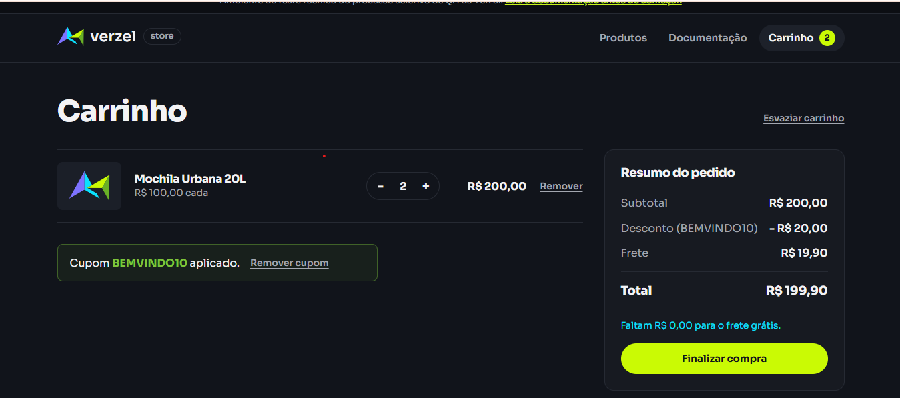
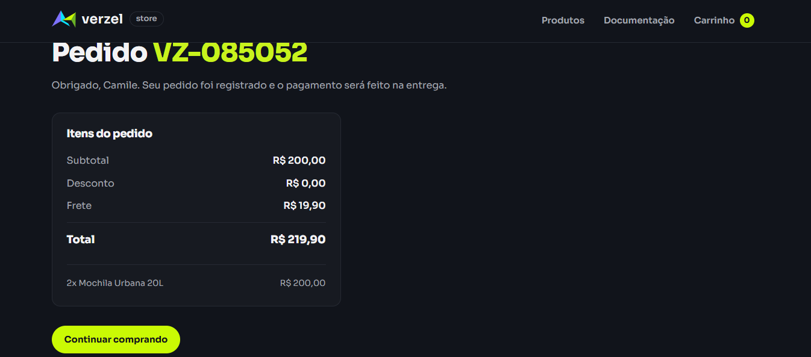
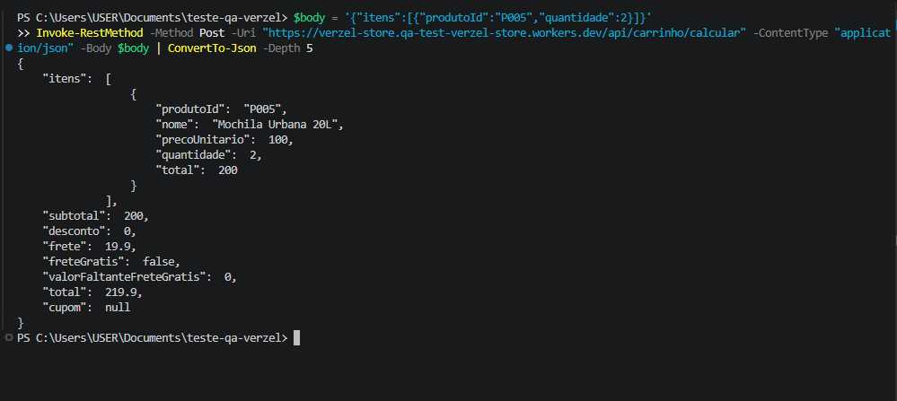
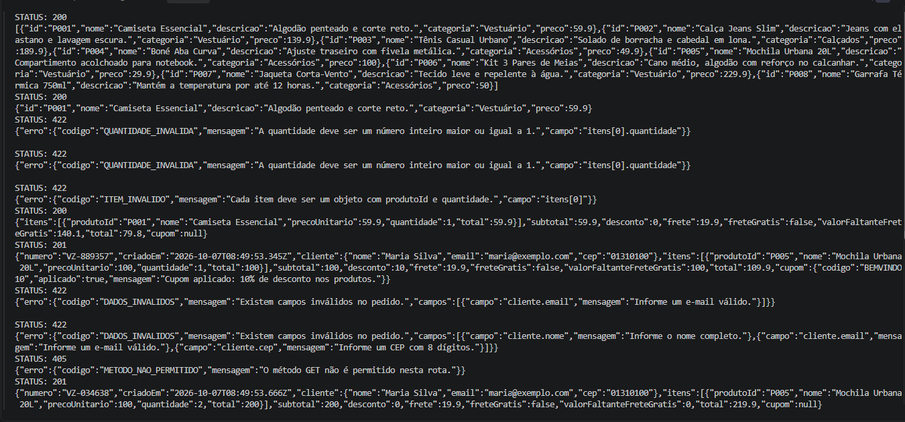

# BUG-01: Frete cobrado (R$ 19,90) quando o subtotal é exatamente R$ 200,00

- **Severidade:** Alta (o cliente paga frete que deveria ser grátis)
- **Prioridade:** Alta (corrigir antes de liberar a entrega)
- **Card:** VZS-142 | **Status:** Aberto
- **Regras violadas:** CA06 – "O frete é grátis para compras com subtotal a partir de R$ 200,00, inclusive." e CA08 (no caso com cupom, o frete considera o subtotal antes do desconto)
- **Cenários relacionados:** CT03 (sem cupom), CT14 (com cupom), CT47 (pedido via API)
- **Ambiente:** Chrome/Edge e PowerShell (Invoke-RestMethod e Invoke-WebRequest), Windows, loja v2.3.0
- **Datas:** interface e cálculo em 06/10/2026; pedido VZ-034638 (CT47) em 07/10/2026

## Passos para reproduzir

**Pela interface**
1. Acessar a loja e abrir "Produtos".
2. Adicionar 2 unidades da "Mochila Urbana 20L" (R$ 100,00 cada).
3. Abrir o carrinho e conferir o "Resumo do pedido".
4. (Opcional) Aplicar o cupom BEMVINDO10 e conferir novamente.

**Pela API**
1. Enviar POST para /api/carrinho/calcular com `{"itens":[{"produtoId":"P005","quantidade":2}]}`.
2. Enviar POST para /api/pedidos com `{"cliente":{"nome":"Maria Silva","email":"maria@exemplo.com","cep":"01310100"},"itens":[{"produtoId":"P005","quantidade":2}]}`.

## Resultado atual

- **Tela, sem cupom:** subtotal R$ 200,00, frete R$ 19,90, total R$ 219,90.
- **Tela, com cupom:** subtotal R$ 200,00, desconto R$ 20,00, frete R$ 19,90, total R$ 199,90.
- **Contradição na tela:** o carrinho exibe "Faltam R$ 0,00 para o frete grátis" ao mesmo tempo que cobra o frete.
- **API /api/carrinho/calcular:** frete 19.9, freteGratis false, valorFaltanteFreteGratis 0, total 219.9.
- **API /api/pedidos:** status 201, pedido VZ-034638, frete 19.9, freteGratis false, total 219.9.
- **Contradição na API:** valorFaltanteFreteGratis = 0 (meta atingida) com freteGratis = false.

## Resultado esperado

- Sem cupom: frete grátis (R$ 0,00), total R$ 200,00.
- Com cupom: desconto R$ 20,00, frete grátis, total R$ 180,00.
- API: frete 0, freteGratis true, total 200.

## Evidências

- Tela, com cupom: 
- Tela, pedido sem cupom: 
- API, cálculo: 
- API, pedido (último resultado da imagem, pedido VZ-034638, cenário CT47): 

## Hipótese sobre a causa

O cálculo do frete provavelmente compara o subtotal com 200 usando "maior que" (>) no lugar de "maior ou igual" (>=). A interface só exibe o que a API devolve (conforme a documentação), e o bug aparece nos dois endpoints, o que indica uma regra de cálculo compartilhada.

## Observações

- Subtotal R$ 199,80 cobra frete corretamente (CT04) e subtotal R$ 219,80 tem frete grátis (CT05). O problema está somente no valor exatamente igual ao limite.
- Reproduzido na tela (carrinho e confirmação do pedido) e na API (cálculo e pedido).
