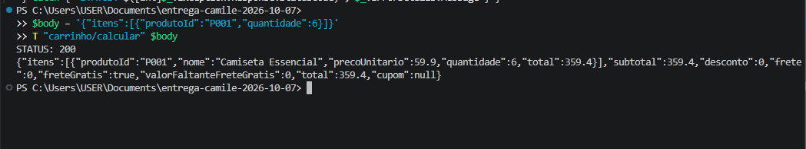
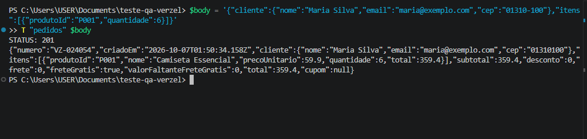
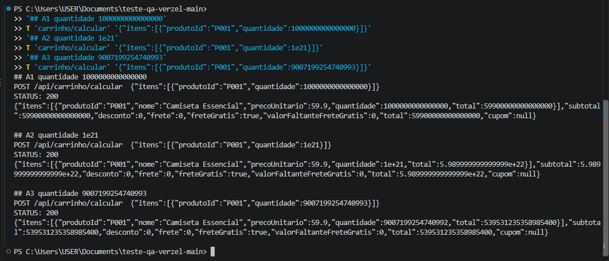

# BUG-02: API não valida o limite de quantidade por produto (aceita de 6 até 1e21 unidades)

- **Severidade:** Alta (a regra CA10 só é aplicada pela interface; a API aceita qualquer quantidade, inclusive valores absurdos)
- **Prioridade:** Média
- **Card:** VZS-142 | **Status:** Aberto
- **Regras violadas:** CA10 – "Cada produto pode ter no máximo 5 unidades por pedido. A regra vale para a interface e para a API." e CA11 (valores com notação científica e erro de ponto flutuante)
- **Cenários relacionados:** CT16 e CT17 (6 unidades), CT52, CT53 e CT54 (quantidades absurdas)
- **Ambiente:** PowerShell (Invoke-WebRequest), Windows, loja v2.3.0, 06/10/2026 (casos A e B) e 09/10/2026 (casos C, D e E)

## Passos para reproduzir

Comandos prontos em [`reproduzir-api.ps1`](reproduzir-api.ps1) (grupo A): os itens A0 e A0b cobrem os casos A e B (6 unidades); A1, A2 e A3 cobrem os casos C, D e E.

**Caso A: cálculo com 6 unidades**
1. POST /api/carrinho/calcular com `{"itens":[{"produtoId":"P001","quantidade":6}]}`

**Caso B: pedido com 6 unidades**
1. POST /api/pedidos com `{"cliente":{"nome":"Maria Silva","email":"maria@exemplo.com","cep":"01310-100"},"itens":[{"produtoId":"P001","quantidade":6}]}`

**Caso C: quantidade de 1 quatrilhão**
1. POST /api/carrinho/calcular com `{"itens":[{"produtoId":"P001","quantidade":1000000000000000}]}`

**Caso D: quantidade de 1e21**
1. POST /api/carrinho/calcular com `{"itens":[{"produtoId":"P001","quantidade":1e21}]}`

**Caso E: quantidade acima do maior inteiro seguro do JavaScript**
1. POST /api/carrinho/calcular com `{"itens":[{"produtoId":"P001","quantidade":9007199254740993}]}`

## Resultado atual

| Caso | Endpoint | Resposta |
|---|---|---|
| A | /api/carrinho/calcular | 200, quantidade 6, subtotal 359,40, frete grátis, total 359,40 |
| B | /api/pedidos | 201, pedido VZ-024054 confirmado com quantidade 6 (total 359,40) |
| C | /api/carrinho/calcular | 200, quantidade 1000000000000000, subtotal 59900000000000000, frete grátis |
| D | /api/carrinho/calcular | 200, quantidade 1e+21, subtotal 5.989999999999999e+22 (notação científica e erro de ponto flutuante) |
| E | /api/carrinho/calcular | 200, enviado 9007199254740993 e devolvido **9007199254740992** (o valor foi alterado sem aviso); subtotal 539531235358985400 calculado sobre o valor alterado |

## Resultado esperado

Status 422 com o código QUANTIDADE_MAXIMA_EXCEDIDA e o campo itens[0].quantidade, nos dois endpoints, para qualquer quantidade acima de 5.

## Evidências

- A: 
- B: 
- C, D e E: 

## Observações

- A interface bloqueia a 6ª unidade (CT06 e CT07), então a validação existe só no front-end.
- Com 5 unidades a API responde 200 normalmente (CT18), como esperado.
- O caso E mostra perda de precisão: acima de 9007199254740991 (o maior inteiro seguro em JavaScript) a API não preserva o valor enviado. Para valores financeiros isso é um risco adicional, que a validação do limite resolveria.
- **Reclassificação:** a severidade foi elevada de Média para Alta depois que os casos C, D e E mostraram que não existe nenhum limite no servidor. A validação de uma regra de negócio precisa acontecer no backend, que não pode depender da interface.
