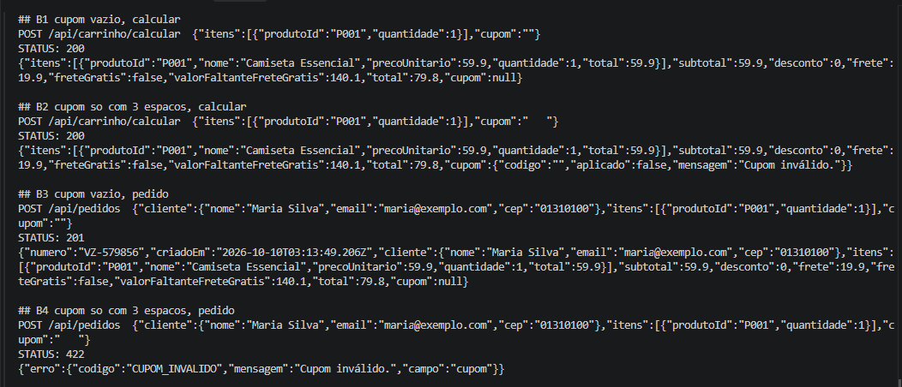
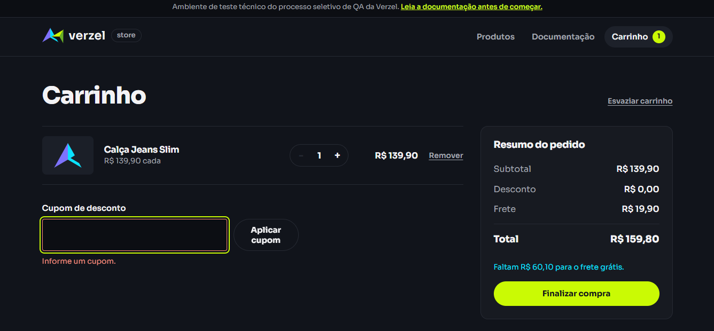

# BUG-03: Cupom com apenas espaços não é tratado como cupom vazio e os endpoints divergem

- **Severidade:** Baixa (afeta chamadas diretas à API; o cliente pode contornar enviando o pedido sem o campo)
- **Prioridade:** Baixa
- **Card:** VZS-142 | **Status:** Aberto
- **Regra violada:** CA02 – "espaços no início e no fim são ignorados". Depois de remover os espaços, `"   "` vira `""`, que a API já trata como "sem cupom" (CT42).
- **Cenários relacionados:** CT50 (cálculo) e CT51 (pedido); referência: CT42 e AMB01
- **Ambiente:** PowerShell (Invoke-WebRequest), Windows, loja v2.3.0, 10/10/2026

## Passos para reproduzir

Comandos prontos em [`reproduzir-api.ps1`](reproduzir-api.ps1) (grupo B).

1. POST /api/carrinho/calcular com `{"itens":[{"produtoId":"P001","quantidade":1}],"cupom":""}`
2. POST /api/carrinho/calcular com o mesmo corpo e `"cupom":"   "` (3 espaços)
3. POST /api/pedidos com cliente válido, 1 unidade de P001 e `"cupom":""`
4. POST /api/pedidos com o mesmo corpo e `"cupom":"   "` (3 espaços)

## Resultado atual

| Cupom enviado | /api/carrinho/calcular | /api/pedidos |
|---|---|---|
| `""` (vazio) | 200, `cupom: null`, sem desconto | 201, pedido VZ-579856 criado, `cupom: null` |
| `"   "` (3 espaços) | 200, `cupom: {"codigo":"","aplicado":false,"mensagem":"Cupom inválido."}` | 422 `CUPOM_INVALIDO` |

## Resultado esperado

`"   "` deve se comportar exatamente como `""` nos dois endpoints: cálculo sem cupom (`cupom: null`) e pedido criado com status 201.

## Evidências

- API: 
- Interface (comportamento correto): 

## Observações

- O código devolvido na resposta é `""`, ou seja, os espaços são removidos. A hipótese é que a verificação "tem cupom?" acontece antes de remover os espaços.
- Os dois endpoints dão respostas diferentes para a mesma entrada: o cálculo responde 200 com mensagem e o pedido é recusado.
- Na interface, um cupom só com espaços mostra "Informe um cupom.", o mesmo aviso do campo vazio (EXP09). Por isso o impacto fica restrito a chamadas diretas à API.
- Esse achado corrige a AMB01: cupom vazio e cupom só com espaços **não** são tratados da mesma forma.
