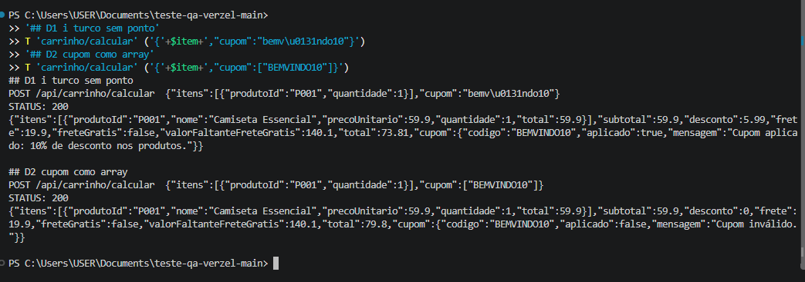

# Observações adicionais (não classificadas como bug)

Comportamentos reproduzidos na API em 09/10/2026 que a documentação não define. Ficam registrados para a equipe decidir se viram regra, ambiguidade ou melhoria. Comandos em [`reproduzir-api.ps1`](reproduzir-api.ps1) (grupo D).

## OBS01: letra "ı" (i turco sem ponto) é aceita como "I" no cupom

- **Requisição:** POST /api/carrinho/calcular com `"cupom":"bemv\u0131ndo10"` (o `\u0131` é o caractere "ı").
- **Resposta:** 200, cupom `BEMVINDO10` aplicado, desconto 5,99, total 73,81.
- **Comentário:** é um texto diferente de `BEMVINDO10`, mas é reconhecido como o cupom original. Provavelmente a conversão para maiúsculas transforma "ı" em "I". A CA02 só fala de maiúsculas e minúsculas, então não há regra violada. Fica o risco caso a validação passe a depender de comparação exata.

## OBS02: cupom enviado como lista (array) volta com código válido e `aplicado: false`

- **Requisição:** POST /api/carrinho/calcular com `"cupom":["BEMVINDO10"]`.
- **Resposta:** 200, `cupom: {"codigo":"BEMVINDO10","aplicado":false,"mensagem":"Cupom inválido."}`, sem desconto.
- **Comentário:** a resposta é contraditória, pois mostra o código de um cupom válido com a mensagem "Cupom inválido.". A documentação não define o tipo do campo `cupom`. O ideal seria rejeitar tipos fora do contrato com 422.

## Evidência

